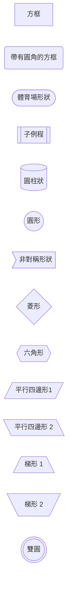
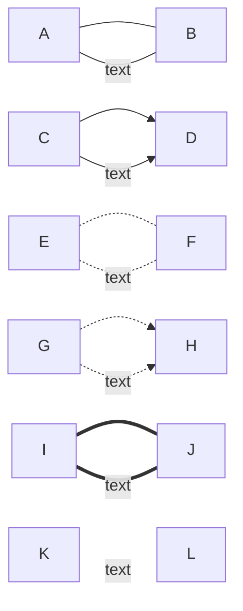
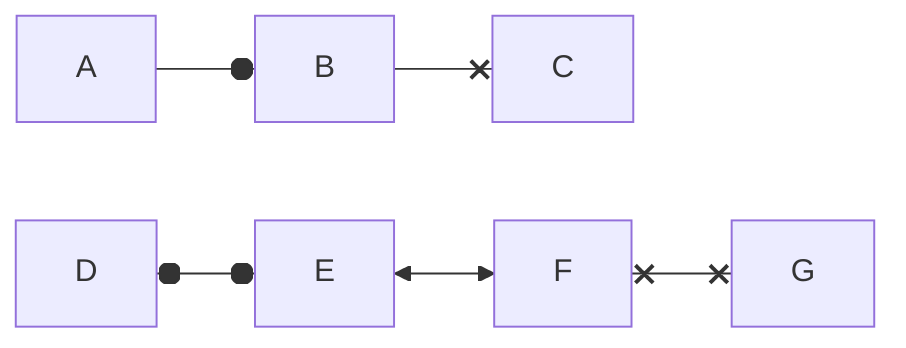
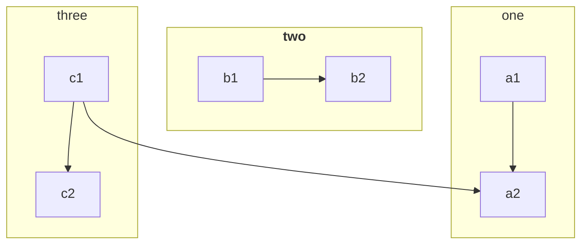



```mermaid
graph LR
  id1[方框]
  id2(帶有圓角的方框)
  id3([體育場形狀])
  id4[[子例程]]
  id5[(圓柱狀)]
  id6((圓形))
  id7>非對稱形狀]
  id8{菱形}
  id9{{六角形}}
  id10[/平行四邊形1/]
  id11[\平行四邊形 2\]
  id12[/梯形 1\]
  id13[\梯形 2/]
  id14(((雙圓)))
```





```mermaid
graph LR
  A --- B
  A ---|text| B
  C --> D
  C -->|text| D
  E -.- F
  E -.-|text| F
  G -.-> H
  G -.->|text| H
  I === J
  I ===|text| J
  K ~~~ L
  K ~~~|text| L
```

```mermaid
flowchart LR
    A --o B
    B --x C

    D o--o E
    E <--> F
    F x--x G

```





```mermaid
flowchart TD
    c1-->a2

    subgraph one
    a1-->a2
    end

    subgraph "`**two**`"
    b1-->b2
    end

    subgraph three
    c1-->c2
    end
```


