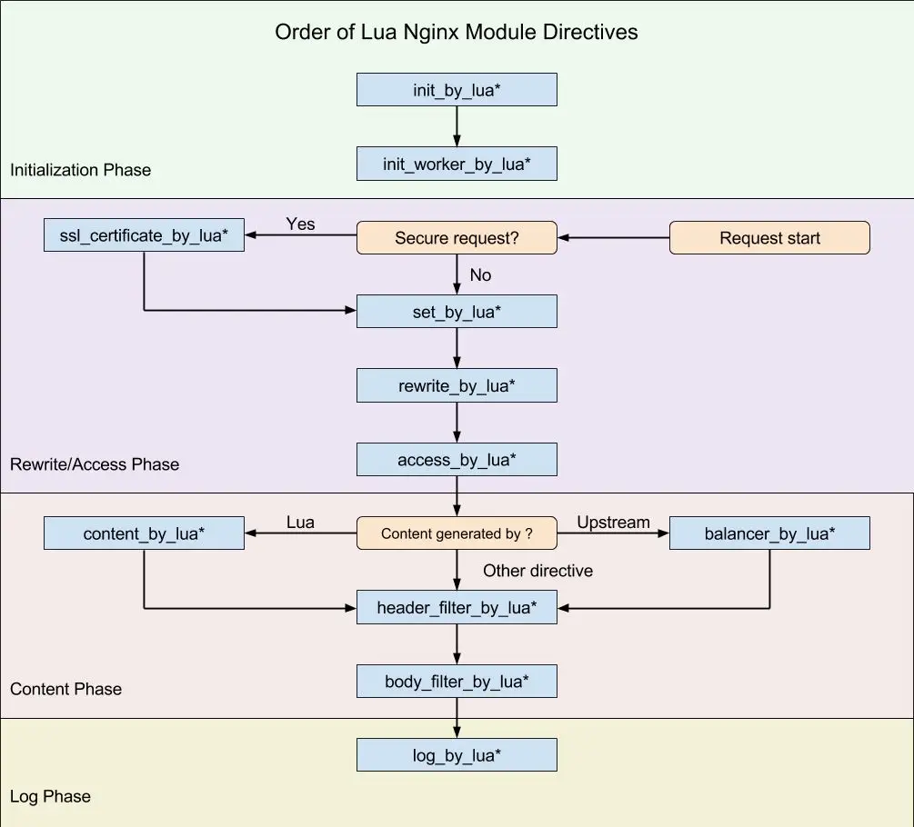

- [Nginx 請求處理流程你了解嗎？](https://mp.weixin.qq.com/s/otQIhuLABU3omOLtRfJnZQ)

### 11 個處理階段

1）NGX_HTTP_POST_READ_PHASE：

接收到完整的 HTTP 標頭後處理的階段，位於 URI 重寫之前。實際上很少有模組會註冊在該階段，預設情況下會被跳過。

2）NGX_HTTP_SERVER_REWRITE_PHASE：

在 URI 與 location 匹配前修改 URI 的階段，用於重新導向。該階段執行 server 區塊內、location 區塊外的重寫指令。在讀取請求標頭的過程中，nginx 會根據 host 及埠號找到對應的虛擬主機設定。

3）NGX_HTTP_FIND_CONFIG_PHASE：

根據 URI 尋找匹配的 location 設定項階段，使用重寫後的 URI 來查找對應的 location。需要注意的是該階段可能會被執行多次，因為也可能有 location 級別的重寫指令。

4）NGX_HTTP_REWRITE_PHASE：

上一階段找到 location 後再次修改 URI，屬於 location 級別的 URI 重寫階段，也可能會被執行多次。

5）NGX_HTTP_POST_REWRITE_PHASE：

防止重寫 URL 後導致的死循環，屬於 location 重寫的下一階段，用來檢查上階段是否有 URI 重寫，並根據結果跳轉到合適的階段。

6）NGX_HTTP_PREACCESS_PHASE：

下一階段之前的準備，屬於存取權限控制的前一階段。一般也用於存取控制，例如限制存取頻率、連線數等。

7）NGX_HTTP_ACCESS_PHASE：

讓 HTTP 模組判斷是否允許請求進入 Nginx 伺服器的存取控制階段，例如基於 IP 白名單/黑名單、使用者名稱密碼等的權限控制。

8）NGX_HTTP_POST_ACCESS_PHASE：

存取控制的後一階段，根據上一階段的執行結果進行處理，向使用者送出拒絕服務的錯誤碼，用來回應上一階段的拒絕。

9）NGX_HTTP_TRY_FILES_PHASE：

為存取靜態檔案資源而設置，try_files 指令的處理階段。如果沒有設定 try_files 指令，該階段會被跳過。

10）NGX_HTTP_CONTENT_PHASE：

處理 HTTP 請求內容的階段，多數 HTTP 模組會介入此階段。內容生成階段會產生回應並送回用戶端。

11）NGX_HTTP_LOG_PHASE：

請求處理完成後的記錄階段，該階段會記錄存取日誌。

以上 11 個階段中，HTTP 無法介入的階段有 4 個：

3）NGX_HTTP_FIND_CONFIG_PHASE

5）NGX_HTTP_POST_REWRITE_PHASE

8）NGX_HTTP_POST_ACCESS_PHASE

9）NGX_HTTP_TRY_FILES_PHASE

剩下的 7 個階段，HTTP 模組均可介入，且每個階段可介入的模組數量沒有上限，多個 HTTP 模組可同時介入同一階段並作用於同一請求。

### Lua 8 個階段

init_by_lua http
set_by_lua server, server if, location, location if
rewrite_by_lua http, server, location, location if
access_by_lua http, server, location, location if
content_by_lua location, location if
header_filter_by_lua http, server, location, location if
body_filter_by_lua http, server, location, location if
log_by_lua http, server, location, location if

1）init_by_lua：

在 nginx 重新載入設定檔時執行 Lua 腳本，常用於全域變數的配置。（例如：lua_shared_dict 共享記憶體的配置，只有當 nginx 重啟後，共享記憶體資料才會清空，常用於統計。）

2）set_by_lua：

流程分支處理與變數初始化（設定變數，常用於計算邏輯並回傳結果），該階段不能使用 Output API、Control API、Subrequest API、Cosocket API。

3）rewrite_by_lua：

轉發、重新導向、快取等功能（例如特定請求代理到外網，在 access 階段前執行，主要用於 rewrite）。

4）access_by_lua：

IP 准入、介面權限等集中處理（例如配合 iptables 完成簡易防火牆，主要用於存取控制，可收集到大部分變數，像 status 需要在 log 階段才有。該指令執行於 nginx access 階段的末尾，因此總是在 allow/deny 等指令之後執行，雖然它們同屬 access 階段）。

5）content_by_lua：

內容生成，屬於所有請求處理階段中最重要的一個。該階段的指令通常負責生成內容（content）並輸出 HTTP 回應。

6）header_filter_by_lua：

回應的 HTTP 標頭過濾處理，一般只用於設定 Cookie 和 Headers。該階段不能使用 Output API、Control API、Subrequest API、Cosocket API（例如新增標頭資訊）。

7）body_filter_by_lua：

回應內容過濾處理（例如把回應內容統一轉為大寫）。通常在一次請求中會被呼叫多次，因為這是實作基於 HTTP 1.1 chunked 編碼的「串流輸出」。該階段不能使用 Output API、Control API、Subrequest API、Cosocket API。

8）log_by_lua：

會話完成後在本地非同步完成日誌記錄（日誌可寫在本地，也可同步到其他機器）。該階段總是運行在請求結束時，用於請求的後續操作，例如在共享記憶體中統計資料。若要高精度的資料統計，應使用 body_filter_by_lua。該階段不能使用 Output API、Control API、Subrequest API、Cosocket API。

### nginx 與 Lua 執行階段的對應關係

1）init_by_lua，運行在 initialization phase。

2）set_by_lua，運行在 rewrite 階段。

     set 指令來自 ngx_rewrite 模組，運行於 rewrite 階段。

3）rewrite_by_lua 指令來自 ngx_lua 模組，運行於 rewrite 階段的末尾。

4）access_by_lua 指令同樣來自 ngx_lua 模組，運行於 access 階段的末尾。

     deny 指令來自 ngx_access 模組，運行於 access 階段。

5）content_by_lua 指令來自 ngx_lua 模組，運行於 content 階段；不要將它與其他內容處理指令放在同一個 location 內，例如 proxy_pass。

      echo 指令來自 ngx_echo 模組，運行在 content 階段。

6）header_filter_by_lua 運行於 content 階段，output-header-filter 一般用來設定 cookie 和 headers。

7）body_filter_by_lua，運行於 content 階段。

8）log_by_lua，運行在 log phase。

