# Getting to know Ansible.

## Outline

-  [Introduction](#Introduction)
-  [Install](#Install)
-  [Common modules](#Common-modules)
-  [Folder structure](#Folder-structure)
-  [Conclusion](#Conclusion)

---

### Introduction

* 安裝部署工具、設定管理工具等

* 同類型工具：Chef、Puppet、SaltStack

* 不需要 Agent、透過 ssh

* Linux 有 python 即可 ( ssh port )

* Win 啟用 winrm 即可 ( 5986 port )
  * https://docs.ansible.com/ansible/latest/user_guide/windows_winrm.html#inventory-options

* 資料夾結構簡單易懂、官方文件豐富易懂、模組多支援設備多、易撰寫

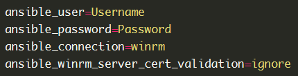

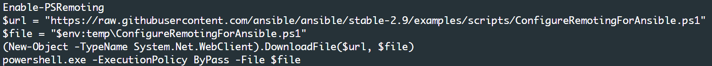

---

### Install

- pip install ansible
  - pip3 install ansible

- yum install ansible

- apt-get install ansible

- apk add ansible

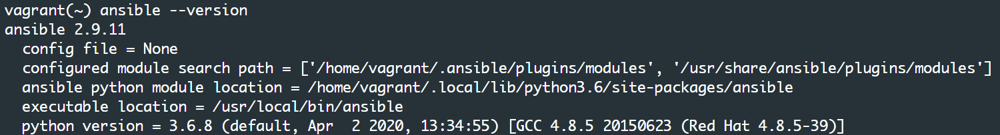

---

### Common modules

[ping](#常用模組-ping)

[shell / command](#常用模組-shell-command)

[file](#常用模組-file)

[yum](#常用模組-yum)

[systemd / service](#常用模組-systemd-service)

[template / copy](#常用模組-template-copy)

[debug](#常用模組-debug)

---

#### Common modules - ping

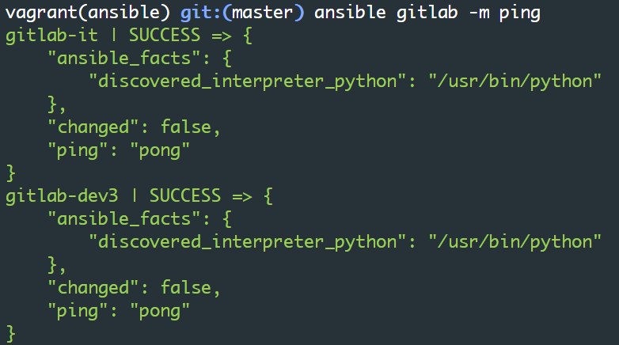

---

#### Common modules - shell / command

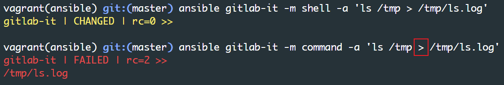

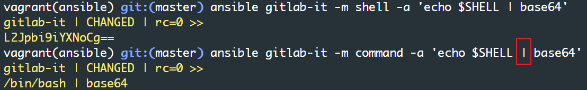

---

#### Common modules - file

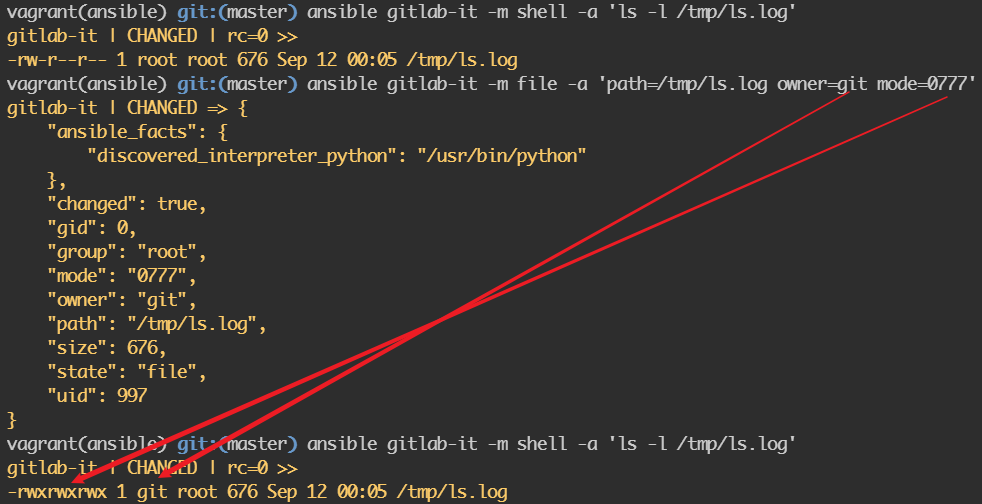

---

#### Common modules - yum

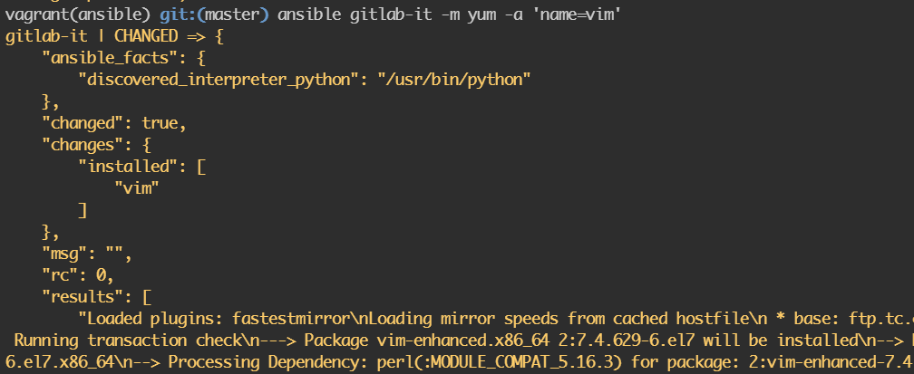

---

#### Common modules - systemd / service

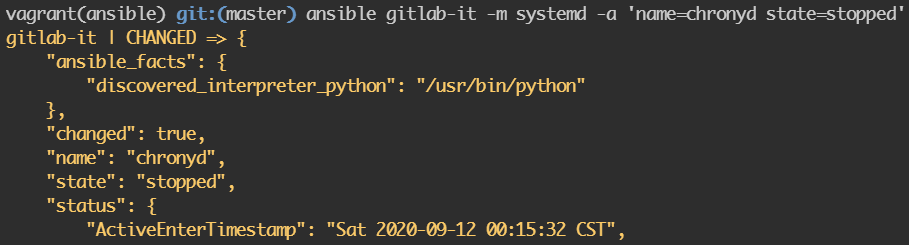

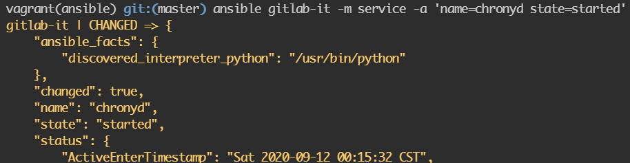

---

#### Common modules - template / copy

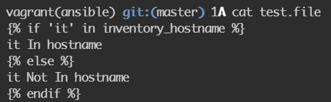

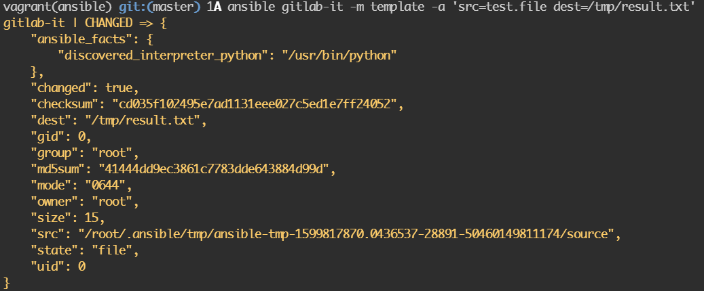

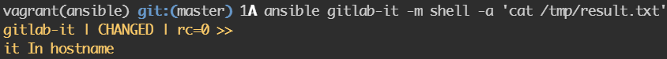

---

#### Common modules - debug / register

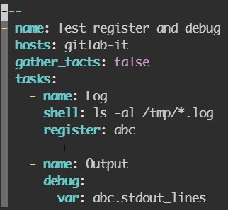

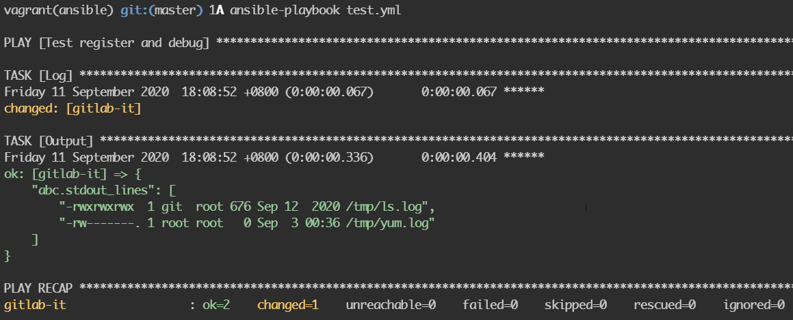

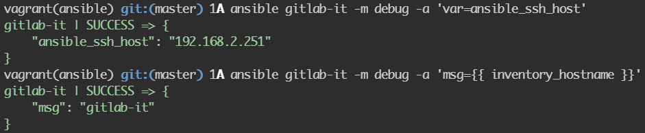

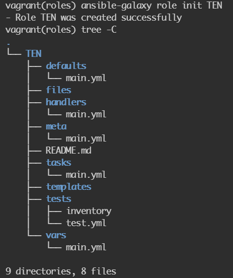

---

### Folder structure

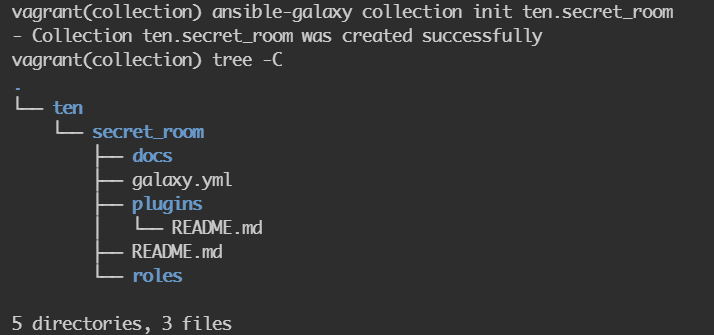

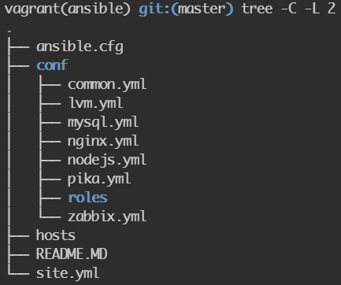

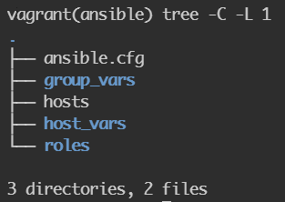

---

### Conclusion

* 選擇適合的
  * ansible ad-hoc
    * `ansible gitlab -m ping`
    * `ansible gitlab -m shell -a 'rm -rf /'`
  * playbook
  * role
  * collection
  * shell script
  * python script
  * others
