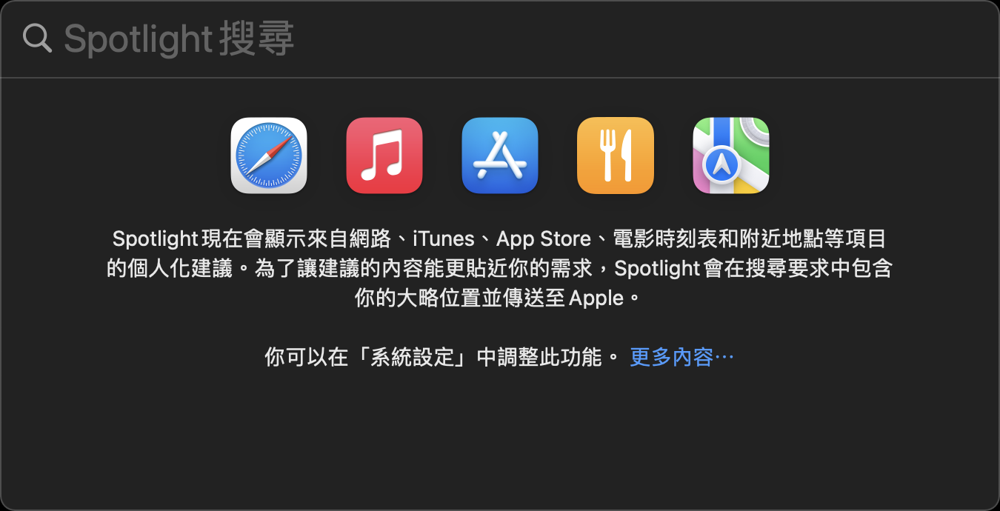
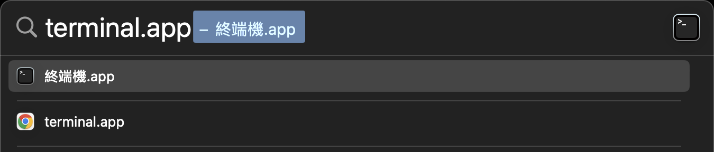
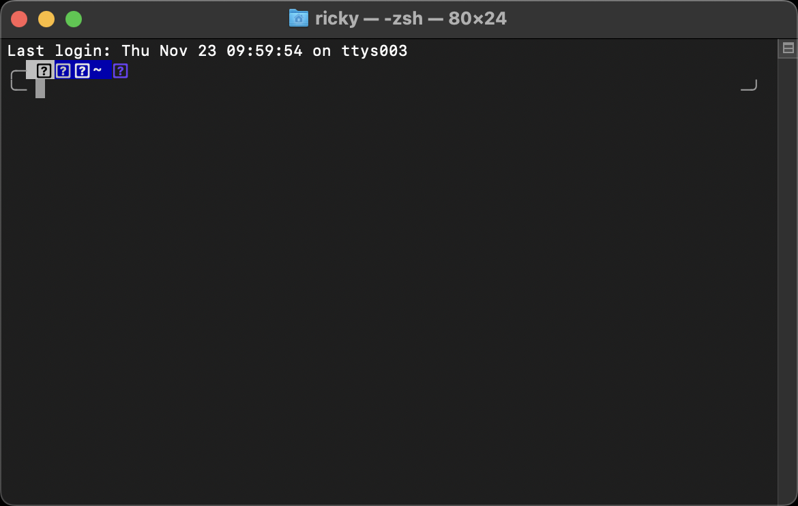

# 使用終端機與 SSH 連線到遠端主機

## 1. 現代終端機

- [Hyper](https://github.com/vercel/hyper)
- [iTerm2](https://iterm2.com/)
- [Tabby](https://github.com/Eugeny/tabby)
- [Warp](https://www.warp.dev/)
- [Wez's Terminal](https://github.com/wez/wezterm)
- [WindTerm](https://github.com/kingToolbox/WindTerm)

## 2. 在 macOS 開啟終端機

1. 按 `⌘ + space` 開啟 Spotlight
   
2. 搜尋 terminal.app
   
3. 按下 `↩`
   

## 3. 使用 SSH 連線到遠端主機

1. 確認私鑰檔案路徑。
2. 在終端機輸入指令：`ssh -i /path/to/private_key.pem ubuntu@ubuntu.host.com`
