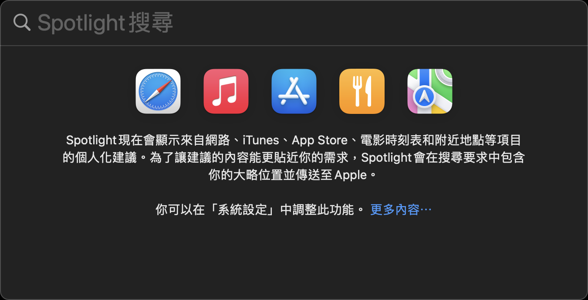
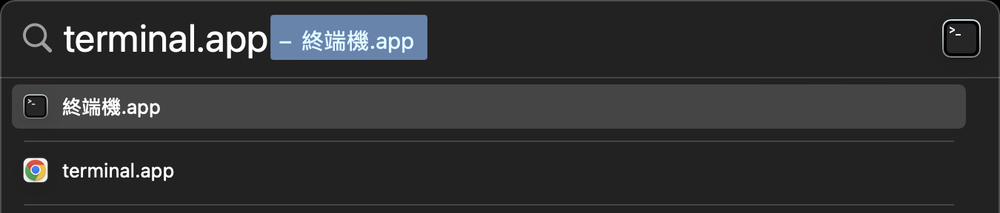
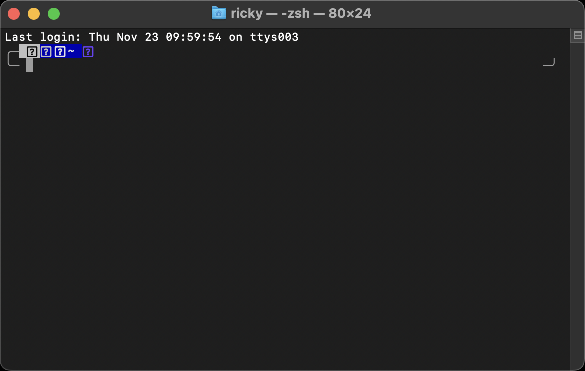

# Use terminal and SSH to remote host

## 1. Modern Terminals

- [Hyper](https://github.com/vercel/hyper)
- [iTerm2](https://iterm2.com/)
- [Tabby](https://github.com/Eugeny/tabby)
- [Warp](https://www.warp.dev/)
- [Wez's Terminal](https://github.com/wez/wezterm)
- [WindTerm](https://github.com/kingToolbox/WindTerm)

## 2. Open terminal in macOS

1. `⌘ + space` open Spotlight
   
2. search terminal.app
   
3. press `↩`
   

## 3. SSH to remote host

1. ensure the private key file path.
2. enter the command in the terminal: `ssh -i /path/to/private_key.pem ubuntu@ubuntu.host.com`
